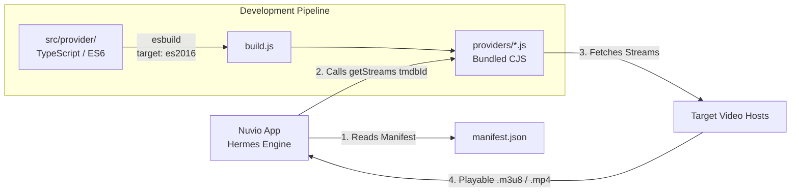

# Nuvio Providers Workspace

[](https://www.typescriptlang.org/)
[](<>)
[](https://google.github.io/styleguide/tsguide.html)
[](LICENSE)

A high-performance, modular developer environment for building, testing, and maintaining streaming providers for the **Nuvio** media application.

---

## 1. Architecture Overview

Nuvio is a decentralized media player. Unlike traditional scrapers that run on remote servers, **Nuvio providers execute locally on the user's client device** (Android TV, Fire TV, Apple TV, Smart TVs, and Mobile) inside React Native's **Hermes JavaScript engine**.



### Key Architectural Constraints:

- **Hermes Engine Compatibility**: Dynamic code execution in Hermes does not natively support ES2017+ async/await without generator transpilation. Our build pipeline transpiles all source code to `es2016` target.
- **Neutral Runtime**: Providers run in an environment supporting standard Web APIs (`fetch`, `URL`, `TextDecoder`), but **without Node.js built-ins** (no `fs`, `path`, or `child_process`).

---

## 2. Using in the Nuvio App

To use this repository as a source in Nuvio:

1. Open **Nuvio** on your device.
2. Go to **Settings** → **Plugins** → **Add Plugin / Repository**.
3. Enter your raw manifest URL:
   ```text
   https://raw.githubusercontent.com/raaghavbhardwaj/nuvio-providers/main/manifest.json
   ```
4. Save and toggle on the providers you wish to use.

---

## 3. Developer Quick Start

### Prerequisites

- **Node.js**: v18.0.0 or higher
- **Package Manager**: [pnpm](https://pnpm.io/) (v9+)

### Installation

```bash
# Clone the repository
git clone git@github.com:raaghavbhardwaj/nuvio-providers.git
cd nuvio-providers

# Install dependencies
pnpm install
```

---

## 4. Development Commands

| Command                    | Description                                                          |
| :------------------------- | :------------------------------------------------------------------- |
| `pnpm build`               | Bundles all providers in `src/` into `providers/`                    |
| `pnpm build <name>`        | Bundles only the specified provider (e.g. `pnpm build uhdmovies`)    |
| `pnpm build:watch`         | Starts native `esbuild` watcher with sub-5ms incremental rebuilds    |
| `pnpm test <name> [id]`    | Runs a provider in terminal and displays resolved streams & latency  |
| `pnpm test <name> --probe` | Pings stream URLs to verify HTTP 200/206 status                      |
| `pnpm validate`            | Validates `manifest.json` schema and file references                 |
| `pnpm typecheck`           | Validates TypeScript types across the repository (`tsc --noEmit`)    |
| `pnpm format`              | Formats all code using Prettier (Google Style)                       |
| `pnpm check`               | Runs full verification (manifest validator, typecheck, format check) |

---

## 5. Building a New Provider

### Step 1: Create Provider Directory

Create a new folder in `src/` named after your provider:

```bash
mkdir -p src/myprovider
```

### Step 2: Implement the Entry Point (`index.ts`)

Write your scraper using the typed `GetStreams` interface:

```typescript
import type { GetStreams, Stream } from '../../types/nuvio';
import { createHeaders, USER_AGENTS } from '../common/headers';

export const getStreams: GetStreams = async (
  tmdbId: string,
  mediaType: 'movie' | 'tv',
  season: number | null,
  episode: number | null
): Promise<Stream[]> => {
  const headers = createHeaders('https://example.com', USER_AGENTS.DESKTOP);

  // 1. Fetch metadata or search by TMDB ID
  const response = await fetch(`https://api.example.com/source/${tmdbId}`, { headers });
  const data = await response.json();

  // 2. Return formatted streams
  return [
    {
      name: 'MyProvider',
      title: 'Server 1 - 1080p (HQ)',
      url: data.streamUrl,
      quality: '1080p',
      format: 'm3u8',
      headers,
    },
  ];
};
```

### Step 3: Register in `manifest.json`

Add your provider metadata to `manifest.json`:

```json
{
  "id": "myprovider",
  "name": "My Provider",
  "description": "Fast HD streams",
  "version": "1.0.0",
  "author": "Your Name",
  "supportedTypes": ["movie", "tv"],
  "filename": "providers/myprovider.js",
  "enabled": true,
  "formats": ["m3u8", "mp4"],
  "logo": "https://example.com/icon.png"
}
```

### Step 4: Build and Test

```bash
# Bundle your provider
pnpm build myprovider

# Test locally against Oppenheimer
pnpm test myprovider 872585 --probe

# Verify repository integrity
pnpm check
```

---

## 6. Shared Utilities (`src/common/`)

To avoid duplicating boilerplate across scrapers, reusable utilities are provided:

- **`src/common/headers.ts`**: Preset User-Agents (`DESKTOP`, `MOBILE`, `ANDROID_TV`) and `createHeaders()` helper that auto-derives Origin and Referer.
- **`src/common/unpacker.ts`**: Dean Edwards `P.A.C.K.E.R` unpacker to decode obfuscated video player scripts (`eval(function(p,a,c,k,e,d)...)`).

---

## 7. Standards & Quality Gates

This repository enforces the **Google TypeScript Style Guide**:

- Strict type safety (no untyped objects or implicit `any`).
- Full TSDoc comments on exported functions.
- Clean separation of concerns between extraction logic and HTTP utilities.
- All commits must follow [Conventional Commits](CONTRIBUTING.md).

---

## 8. License

This project is licensed under the **GNU General Public License v3.0** (GPL-3.0). See [LICENSE](LICENSE) for details.
